# COBOL Reverse Engineering Harness

**Turn an undocumented COBOL estate into verified system knowledge: inventories, data models, execution logic, business rules, diagrams, a knowledge graph and a traceable Business Requirements Document.**

The harness pairs a **deterministic analysis engine** with a **team of AI agents**:

- the engine is tested Python that parses, resolves and measures;
- the agents verify those findings and explain them in business language.

Every fact cites the source line it came from. Every sentence an agent writes is machine-checked before it reaches a deliverable.

> **Status:** all eight stages and their eight agents are implemented, schema-validated and covered by automated tests. They run end to end with one command.

---

## Table of contents

**Part I: The big picture**
- [1. The business problem](#1-the-business-problem)
- [2. What the harness delivers](#2-what-the-harness-delivers)
- [3. Who uses it and how](#3-who-uses-it-and-how)
- [4. How it works in one page](#4-how-it-works-in-one-page)

**Part II: Architecture**
- [5. Architectural principles](#5-architectural-principles)
- [6. System architecture](#6-system-architecture)
- [7. The trust model: facts, meaning and the annotation gate](#7-the-trust-model-facts-meaning-and-the-annotation-gate)
- [8. End-to-end workflow](#8-end-to-end-workflow)
- [9. Artifact flow between stages](#9-artifact-flow-between-stages)

**Part III: The agents in detail**
- [10. Agent anatomy](#10-agent-anatomy)
- [11. Agent 1: Inventory](#11-agent-1-inventory)
- [12. Agent 2: Parser](#12-agent-2-parser)
- [13. Agent 3: Data](#13-agent-3-data)
- [14. Agent 4: Logic](#14-agent-4-logic)
- [15. Agent 5: Rules](#15-agent-5-rules)
- [16. Agent 6: Diagrams](#16-agent-6-diagrams)
- [17. Agent 7: Synthesis (BRD)](#17-agent-7-synthesis-brd)
- [18. Agent 8: Knowledge graph](#18-agent-8-knowledge-graph)

**Part IV: Using the harness**
- [19. Installation](#19-installation)
- [20. Running an analysis](#20-running-an-analysis)
- [21. A worked example](#21-a-worked-example)
- [22. Command reference](#22-command-reference)
- [23. Output reference](#23-output-reference)
- [24. Gap and risk register](#24-gap-and-risk-register)

**Part V: Engineering**
- [25. Repository layout](#25-repository-layout)
- [26. Quality: validation and testing](#26-quality-validation-and-testing)
- [27. Extending the harness](#27-extending-the-harness)
- [28. Known limitations](#28-known-limitations)
- [29. Glossary](#29-glossary)
- [30. License](#30-license)

---

# Part I: The big picture

## 1. The business problem

Core banking, insurance, payroll and logistics still run on COBOL. These systems are reliable, but the knowledge of *what they do and why* has eroded.

| Symptom | Business consequence |
|---|---|
| Documentation is missing or decades out of date | Every change starts with weeks of archaeology |
| The original developers have retired | Business rules live only in code nobody can read |
| Source, JCL, CICS definitions and database schemas are scattered | Nobody can say which programs touch which data |
| Modernisation projects estimate from guesswork | Migrations overrun, rules are lost, defects reach production |
| Auditors ask "where is this rule enforced?" | Answers take days and cannot be proven |

Neither of the usual approaches solves this:

- reading the code by hand does not scale;
- asking a language model to "summarise the system" produces confident text that cannot be verified.

Organisations need **knowledge they can trust**: complete, measured, and traceable to the line of code that proves it.

## 2. What the harness delivers

| Deliverable | What it answers | Primary audience |
|---|---|---|
| **System inventory** | What exists: programs, copybooks, jobs, transactions, screens, tables and files? How are they connected? | Architects, migration leads |
| **Structural model** | How is each program organised? Which code can never run? Which paragraphs are missing? | Developers, QA |
| **Data model** | What does every record look like, byte by byte? Which program reads or writes which dataset or table? | Data architects, DBAs |
| **Execution logic** | What does each program do, step by step, and under which conditions? | Developers, business analysts |
| **Business rules catalogue** | Which validations, limits, calculations and routing decisions are enforced, and where? | Business analysts, SMEs, auditors |
| **Diagrams** | System context, data lineage, ERD, job flows, online conversations, program structure | Everyone |
| **Business Requirements Document (BRD)** | The system explained for business readers, with a prioritised register of gaps and risks | Product owners, sponsors, auditors |
| **Knowledge graph** | Impact analysis, for example: if this copybook changes, what breaks? | Architects, change managers |

Every deliverable is regenerated from the source in minutes, so it stays current as the code changes.

## 3. Who uses it and how

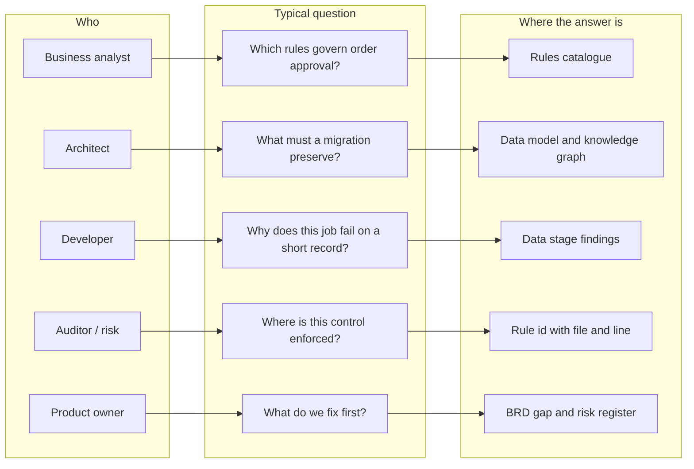

| Business use case | How the harness supports it |
|---|---|
| **Modernisation and migration** | A complete inventory and data model for scoping. The rules catalogue becomes the acceptance baseline. Dead code and missing members are identified before estimates are made. |
| **Regulatory and audit evidence** | Each business rule carries the program, paragraph, file and line that enforce it, and whether that code can actually run. |
| **Change impact analysis** | The knowledge graph answers "who uses this copybook, field or table, and which jobs start them?" |
| **Knowledge transfer** | Program summaries, pseudocode and the BRD let new staff understand the system without reading COBOL. |
| **Production stability** | Mismatched record lengths, VSAM keys, SQL host variables and missing CICS definitions are found before they fail in production. |
| **Application rationalisation** | Programs that no job or transaction starts, unused copybooks and unreachable code are listed with evidence. |

## 4. How it works in one page

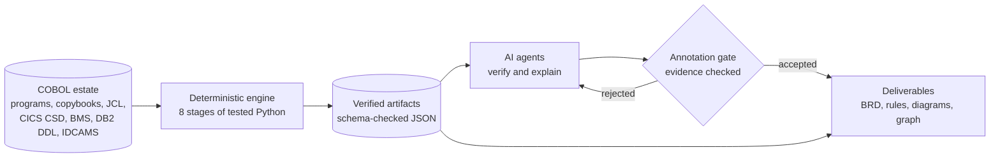

1. **The engine reads everything and computes facts exactly:** references, structure, field sizes and offsets, control flow, data flows, rule candidates and diagrams.
2. **Every stage validates its own output** against a JSON schema and against itself. Counts must match lists, links must point at real things, and cited lines must exist. A failing stage stops the run.
3. **Agents review the facts against the source.** They add what code cannot: business meaning, summaries, rule names, captions and the BRD narrative.
4. **Agent text passes through a gate.** It must cite real source lines or artifact ids. Anything else is rejected and never reaches a deliverable.
5. **Deliverables are assembled** from facts plus accepted annotations, so every statement in the BRD is traceable.

---

# Part II: Architecture

## 5. Architectural principles

| # | Principle | Why it matters |
|---|---|---|
| P1 | **Code computes, agents explain.** Anything that can be determined exactly is done by tested code, never by a language model: parsing, counting, resolving, sizing, graph building. | Numbers and structure are reproducible and correct, not plausible guesses. |
| P2 | **Every fact has provenance.** Each reference, statement, field, rule and gap carries a file and line, or an artifact id. | Any claim can be checked in seconds. |
| P3 | **Fail fast, never silently.** Each stage validates its artifact, and inconsistencies stop the pipeline. | Errors cannot leak downstream and compound. |
| P4 | **Meaning is gated.** Agent-written text is accepted only when its target and evidence exist. | The BRD never contains unsupported statements. |
| P5 | **Uncertainty is explicit.** Every annotation carries a confidence level. Unresolved items become gaps, not assumptions. | Readers know what is proven and what is inferred. |
| P6 | **Regenerate, never hand-edit.** Deliverables are rebuilt from artifacts and annotations on every run. | Documentation stays in step with the code. |
| P7 | **One engine, two agent platforms.** Claude Code and GitHub Copilot agents call the same commands. | No divergent logic between tools. |

## 6. System architecture

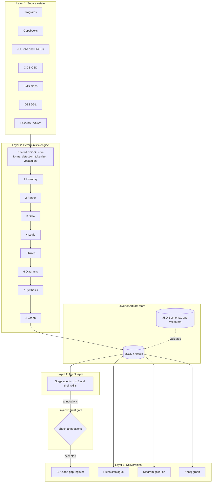

| Layer | Responsibility | Technology |
|---|---|---|
| Source estate | Exported mainframe members, in any folder layout | Plain text files |
| Deterministic engine | Parse, resolve, measure, analyse, render | Python 3.10+, no runtime dependencies |
| Artifact store | One JSON artifact per stage, recording the hashes of its inputs | JSON and JSON Schema (draft 2020-12) |
| Agent layer | Verify and explain | Claude Code agents and skills; GitHub Copilot custom agents |
| Trust gate | Accept only evidence-backed meaning | `harness check-annotations` |
| Deliverables | Human-facing outputs | Markdown, Mermaid, CSV, Cypher |

**The shared COBOL core.** Every stage reads COBOL through one front end:

- **Format detection:** fixed or free format. Sequence and identification areas are ignored.
- **Comment handling:** column-7 indicators, floating `*>` comments, and misplaced comment markers (which are reported).
- **Tokenizer:**
  - keeps literals whole, so words inside strings are never mistaken for code;
  - keeps PICTURE strings intact;
  - joins continuation lines;
  - records the file, line and column of every token, so copybook text still points at the copybook.
- **Vocabulary:** reserved words, verbs and scope terminators.

## 7. The trust model: facts, meaning and the annotation gate

The harness separates two kinds of content and treats them differently.

| | Facts | Meaning |
|---|---|---|
| Examples | "ORDBATCH copies ORDREC at line 11"; "ORD-PRICE is a 5-byte COMP-3 field at offset 11"; "this paragraph is never reached" | "ORDREC is the customer order record"; "this rule prevents empty order lines" |
| Produced by | Deterministic engine | AI agents |
| Stored in | `*_artifact.json` and per-item files | `*_annotations.json` |
| Verified by | Schema and self-consistency validators | The `check-annotations` evidence gate |
| Can it be wrong? | Only through an engine defect, which the tests guard against | Yes. That is why it carries a confidence level and must cite evidence. |

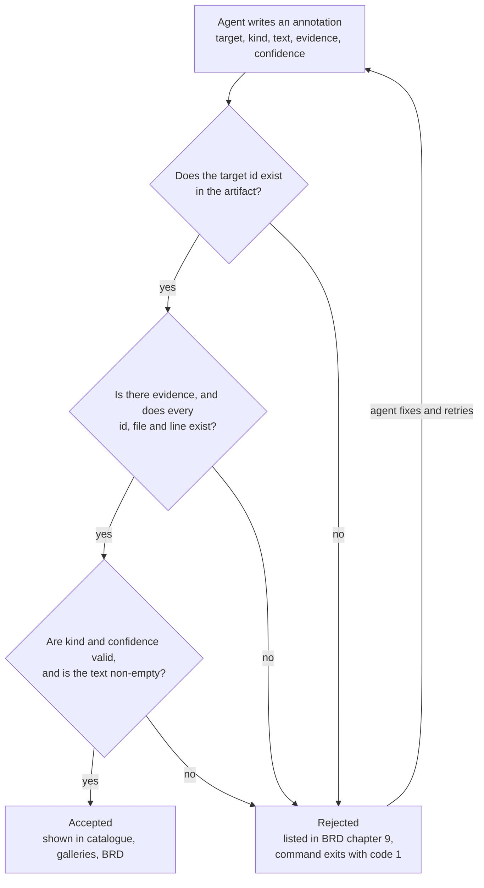

An annotation looks like this:

```json
{
  "target": "rule:ORDBATCH:29",
  "kind": "name",
  "text": "An order line must have a positive quantity",
  "evidence": [{"path": "cbl/ORDBATCH.cbl", "line": 29}],
  "confidence": "high"
}
```

| Field | Allowed values |
|---|---|
| `kind` | `description`, `name`, `summary`, `narrative`, `caption`, `note`, `verdict` |
| `evidence` | `{"path": ..., "line": ...}` for a source line, or `{"id": ...}` for an artifact id |
| `confidence` | `high` (the code makes the meaning unambiguous), `medium` (well supported, with some inference), `low` (plausible, needs SME confirmation) |

## 8. End-to-end workflow

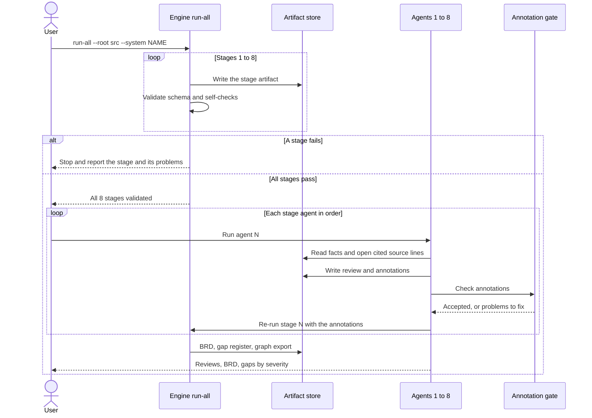

**The lifecycle of every stage**

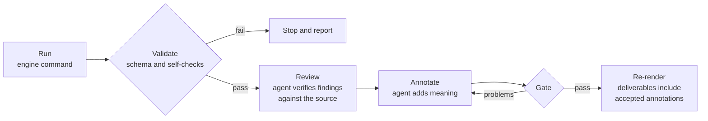

## 9. Artifact flow between stages

Each stage reads only the artifacts of earlier stages. It goes back to the source only to read statement text. Each artifact records the SHA-256 hash of its inputs.

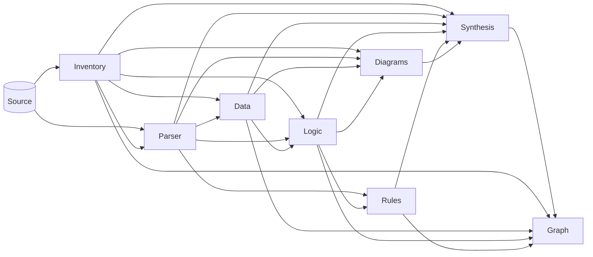

| Stage | Consumes | Produces | Ids it introduces |
|---|---|---|---|
| 1 Inventory | source | `inventory_artifact.json` | `program:`, `copybook:`, `job:`, `transaction:`, `map:`, `table:`, `dataset:`; reference ids such as `R00001` |
| 2 Parser | inventory, source | `parser_artifact.json`, `raw_structure/<PROGRAM>.json` | paragraphs, statements (by file and line) |
| 3 Data | inventory, parser | `data_artifact.json`, `data_layouts/` | `record:`, `field:`, `condition:` |
| 4 Logic | inventory, parser, data | `logic_artifact.json`, `program_logic/<PROGRAM>.json` | `branch:<PGM>:B<n>`, `loop:<PGM>:L<n>` |
| 5 Rules | parser, logic | `rules_artifact.json`, `rules_catalog.md` | `rule:<PGM>:<line>`, `rulegroup:<n>` |
| 6 Diagrams | inventory, parser, data, logic | `diagrams_artifact.json`, `diagrams/*.mmd`, galleries | `diagram:<name>` |
| 7 Synthesis | all of the above, plus all annotations | `synthesis_artifact.json`, `brd.md`, `brd_summary.md`, `gaps_register.md` | `brd:<section>`, `gap:<code>:<subject>` |
| 8 Graph | inventory, data, logic, rules, synthesis | Neo4j CSVs, `import.cypher`, query library | graph node ids |

---

# Part III: The agents in detail

## 10. Agent anatomy

Every stage has two parts:

- an **agent**, which defines the role, the steps and the rules;
- a **skill**, the detailed operating manual for the stage's command and output.

Agents exist in two formats, generated from one source:

| Platform | Agent | Skill |
|---|---|---|
| Claude Code | `.claude/agents/<N>_<name>.md` | `.claude/skills/<skill>/SKILL.md` |
| GitHub Copilot | `.github/agents/<N>_<name>.agent.md` | `.github/skills/<skill>/SKILL.md` |

The `.claude` files are the source of truth. `python -m harness sync-agents` regenerates the Copilot copies, and a test fails if the two drift apart.

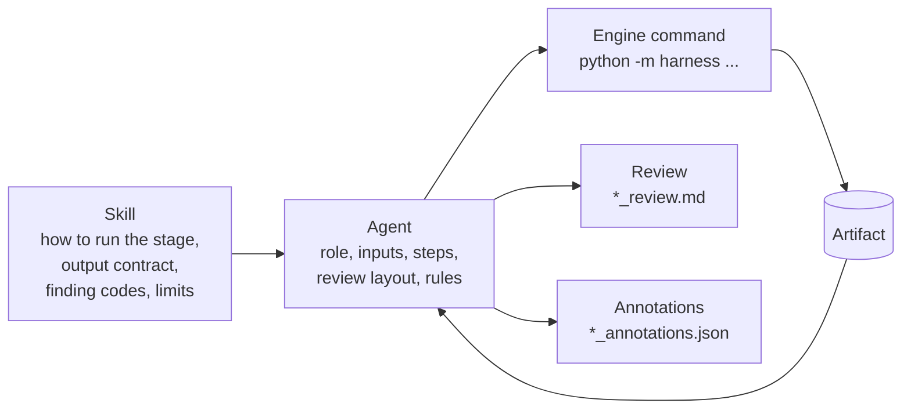

**Rules every agent follows**

- Never edit generated artifacts. If a fact is wrong, report a defect in the stage.
- Take every number from an artifact; never estimate.
- Cite `path:line` or an artifact id for every finding.
- Treat the COBOL source as read-only.
- Put meaning only into annotations, and make sure they pass the gate.

| Agent | Skill | Engine command | What the agent itself contributes |
|---|---|---|---|
| 1 Inventory | inventory-scanner | `inventory` | verifies every warning |
| 2 Parser | cobol-parser | `parse` | verifies findings and spot-checks structure |
| 3 Data | data-modeler | `data` | entity and record descriptions |
| 4 Logic | logic-extractor | `logic` | program summaries |
| 5 Rules | rule-miner | `rules` | business names and descriptions for rules |
| 6 Diagrams | diagram-builder | `diagrams` | captions and diagram truth checks |
| 7 Synthesis | brd-writer | `synthesize` | the BRD's narrative chapters |
| 8 Graph | graph-exporter | `graph` | export checks, and optionally loading and querying |

## 11. Agent 1: Inventory

**Purpose.** Establish what exists and how it connects, with proof for every link.

**Business use cases**

- **Scoping:** exact counts of programs, copybooks, jobs, transactions, screens, tables and datasets for estimates.
- **Dependency mapping:** which program calls which, and which job or transaction starts it.
- **Configuration audit:** for example,
  - missing members;
  - CICS programs without CSD definitions;
  - DB2 programs run without a DB2 attach;
  - JCL whose control cards never reach the utility.

**Where it acts.** First, before every other stage. Re-run it whenever source files are added or changed.

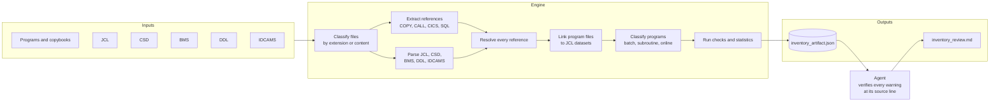

**What the engine computes**

| Capability | Detail |
|---|---|
| File classification | By extension, or by content for `.txt`, `.ctl`, `.dat` and extensionless members |
| COBOL references | COPY (library, SUPPRESS, REPLACING); static and dynamic CALL (with candidate targets from VALUE and MOVE literals); CICS LINK, XCTL, LOAD, RETURN TRANSID, START, SEND and RECEIVE MAP and file commands; EXEC SQL INCLUDE, tables and CALL; FILE-CONTROL SELECT and ASSIGN |
| JCL | Jobs; ordered steps; PGM and PROC; DD statements with DSN, DISP, RECFM and LRECL; in-stream data; IKJEFT01 `RUN PROGRAM`; DFSRRC00; INCLUDE |
| CICS CSD | Transactions, programs, mapsets, and files with dataset names |
| BMS | Mapsets, maps, and named fields with position, length and attributes |
| DB2 DDL | Tables, columns, primary, foreign and unique keys, indexes, views, comments |
| IDCAMS | DEFINE CLUSTER, AIX and GDG, with organisation, keys and record sizes |
| Resolution | Each reference is `resolved`, `unresolved`, `ambiguous`, `system`, `external`, `dynamic`, `temporary` or `undefined` |
| Dataset lineage | Program file (SELECT) to JCL DD to dataset, per job step |
| Program kind | Decided from evidence: EXEC CICS or a CSD entry means online; run by JCL means batch; PROCEDURE DIVISION USING, or being called, means subroutine |
| Scope | `--entry` keeps only what a given job, transaction or program reaches |

**Findings it reports (examples)**

| Code | Meaning |
|---|---|
| `missing_copybook`, `missing_program`, `missing_include`, `missing_map` | A referenced member is not in the scanned source |
| `copy_target_is_program` | A COPY names a program, not a copybook |
| `online_program_not_in_csd` | A CICS program has no CSD PROGRAM definition, so a LINK to it would fail |
| `db2_program_without_attach` | An SQL program runs with `EXEC PGM=` and no DB2 attach |
| `stray_lines` | JCL control statements outside in-stream data, for example after a `//*` that ends SYSIN early |
| `procedure_copybook_in_data_division` | A copybook containing procedure code is copied into storage |
| `possibly_truncated_source`, `empty_file`, `literal_truncated_at_column_72` | Damaged or incomplete members |
| `unused_copybook`, `subroutine_without_callers`, `program_not_executed` | Clean-up candidates |

**What the agent does.**

1. Runs the stage and reads the statistics and issues.
2. Opens every error and warning at its cited line and classifies it as `confirmed`, `false positive` or `environmental`.
3. Writes `inventory_review.md`.

## 12. Agent 2: Parser

**Purpose.** Turn source text into verified structure: every data entry, every statement, and the control flow between paragraphs.

**Business use cases**

- **Effort and risk estimation:** paragraphs, statements, nesting and unstructured flow per program.
- **Dead code identification:** code that can never run, and any business rule inside it.
- **Completeness check:** paragraphs that are performed but do not exist; data names used but never defined.

**Where it acts.** After the inventory. Its output is the foundation for the data, logic, rules and diagram stages.

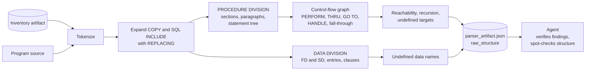

**What the engine computes**

| Capability | Detail |
|---|---|
| Copybook expansion | Nested and recursion-safe. REPLACING supports whole words, pseudo-text, `LEADING` and `TRAILING`, and `:TAG:` partial replacement. Expanded text keeps the copybook's own file and line. |
| Data entries | Levels 01 to 49, 66, 77 and 88; PICTURE, USAGE, VALUE lists and ranges, OCCURS (with DEPENDING ON, keys and INDEXED BY), REDEFINES, SIGN, SYNC, JUSTIFIED, BLANK WHEN ZERO, RENAMES |
| Paragraph detection | Uses the COBOL reserved-word list, so `END-EXEC.` or `EXIT.` is never taken for a paragraph name. Code before the first paragraph is kept as `(mainline)`. |
| Statement tree | IF and ELSE; EVALUATE (ALSO, grouped WHEN, OTHER); PERFORM (out-of-line, THRU, UNTIL, VARYING, TIMES, WITH TEST AFTER, inline); SEARCH; GO TO (with DEPENDING ON); ALTER; CALL; EXEC SQL and EXEC CICS; conditional phrases such as AT END, INVALID KEY, ON SIZE ERROR, ON EXCEPTION and ON OVERFLOW |
| Data flow | The fields each statement reads and writes |
| Control flow | PERFORM ranges (including whole sections), GO TO, CICS HANDLE labels, ALTER, SORT input and output procedures. Reachability follows COBOL fall-through semantics. |

**Findings it reports**

| Code | Meaning |
|---|---|
| `undefined_procedure` | A PERFORM, GO TO or HANDLE target that is not a paragraph or section |
| `dead_paragraph` | A paragraph that can never be reached |
| `recursive_perform` | Paragraphs that perform themselves, directly or indirectly |
| `undefined_data_name` | A name used but not defined in the program or its copybooks |
| `unknown_intrinsic_function` | `FUNCTION x` where x is not an intrinsic function |
| `procedure_code_in_data_division` | Copybook paragraphs copied into storage, so they never execute |
| `unreachable_statement` | A statement after GOBACK, STOP RUN, GO TO or CICS RETURN |

**What the agent does.**

1. Classifies every syntax finding as a `source defect` or a `parser gap`.
2. Verifies samples of each finding type.
3. Compares the statement tree of the largest programs with their source.
4. Writes `parser_review.md`.

## 13. Agent 3: Data

**Purpose.** Know every record byte by byte, and every movement of data between programs and stores.

**Business use cases**

- **Data migration:** exact layouts (size, offset, type, packed or binary) for conversion specifications.
- **Data lineage:** which jobs read and write which datasets and tables.
- **Integrity defects:** records that do not match their dataset, VSAM key or CICS file definition, and SQL host variables that do not match their columns.

**Where it acts.** After the parser. Its layouts and 88-level meanings feed the logic, rules, diagram, synthesis and graph stages.

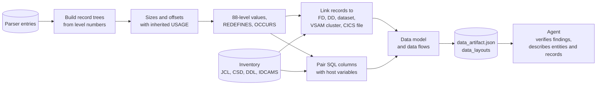

**Storage rules applied (IBM Enterprise COBOL)**

| USAGE | Bytes |
|---|---|
| DISPLAY | one per character position, plus one for SIGN SEPARATE |
| COMP, BINARY, COMP-4, COMP-5 | 2, 4 or 8, for up to 4, 9 or 18 digits |
| COMP-3, PACKED-DECIMAL | digits / 2 + 1 (integer division) |
| COMP-1 and COMP-2 | 4 and 8 |
| POINTER, INDEX | 4 |
| NATIONAL, DISPLAY-1 | 2 per position |

For example, `ORD-PRICE PIC S9(7)V99 COMP-3` has 9 digits, so it takes 9 / 2 + 1 = 5 bytes.

**Findings it reports**

| Code | Meaning |
|---|---|
| `record_length_mismatch` | The record size disagrees with the DD's LRECL and RECFM, or with a fixed-length cluster |
| `vsam_key_mismatch` | No field sits exactly on the cluster's KEYS (length, offset) |
| `cics_record_size_mismatch` | A CICS READ or WRITE record differs from the CSD RECORDSIZE |
| `sql_column_count_mismatch` | INSERT, SELECT or FETCH columns differ from the host variables (host structures are expanded) |
| `host_variable_type_mismatch` | A PICTURE or USAGE does not suit the column type (CHAR, DECIMAL, INTEGER, DATE and so on) |
| `unknown_column` | SQL names a column the DDL does not define |
| `value_too_long`, `redefines_larger_than_target`, `group_with_picture` | Layout defects |
| `empty_record` | An 01 with no subordinates (a COPY under it starts its own 01) |

**What the agent does.**

1. Verifies every warning against the DDL, JCL, IDCAMS or CSD it cites.
2. Describes every data store the programs use, and every shared or file-bound record.
3. Gives business names to key fields and coded values.
4. Checks its annotations.
5. Writes `data_review.md`, including data lineage and open questions for SMEs.

## 14. Agent 4: Logic

**Purpose.** Explain what each program does, step by step and under which conditions, so that a reader who does not know COBOL can follow it.

**Business use cases**

- **Knowledge transfer:** plain-English program summaries backed by line-level evidence.
- **Behaviour verification:** every decision with its condition, its 88-level meanings and its outcomes.
- **Operational risk:** loops that may never end, and error paths that swallow errors.

**Where it acts.** After the data stage. It is the main input for the rules, diagrams and the BRD.

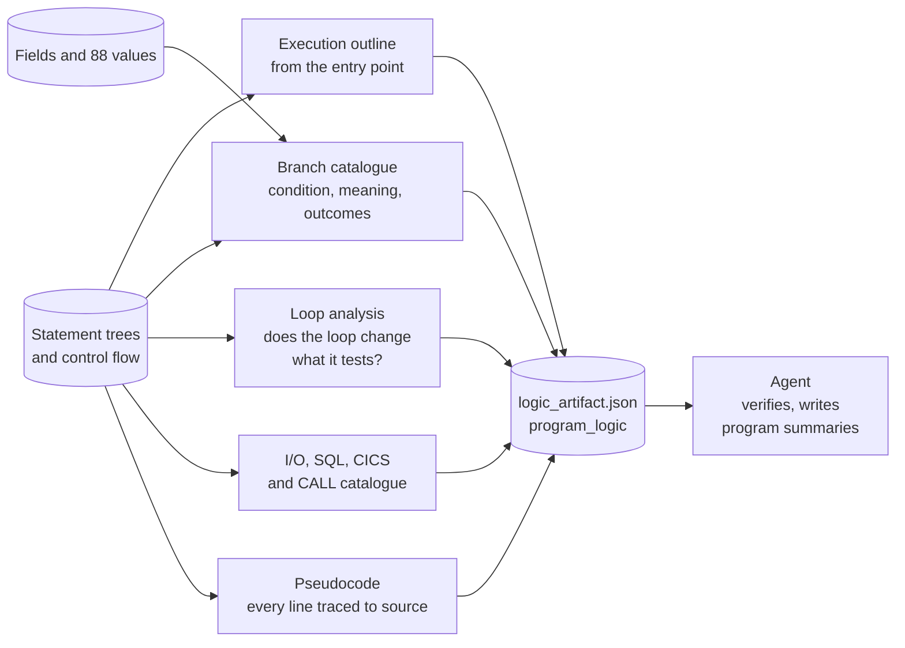

**What the engine computes**

| Output | Detail |
|---|---|
| Outline | A tree from the entry paragraph: performs (with loops and THRU), inline loops, calls, CICS LINK, XCTL, SEND, RECEIVE and RETURN, GO TO and program end. Each node records the conditions under which it happens. |
| Branches | `branch:<PGM>:B<n>`, covering IF, EVALUATE WHEN, SEARCH WHEN and conditional phrases. Each records the fields tested, their 88-level meanings and the top-level actions per outcome. |
| Loops | `loop:<PGM>:L<n>`, with its type, condition, fields tested and fields changed inside the loop. Changes are tracked through performed paragraphs, groups and subfields, 88-level SETs and SQLCODE. Each loop gets a termination verdict. |
| I/O | File verbs; SQL statements with tables and host variables; CICS commands with options; CALLs with parameters |
| Pseudocode | `DO P THRU Q`, `WHILE NOT (c)`, `REPEAT UNTIL`, `SELECT CASE`, `SET x = y`, `RETURN TO CALLER`, with 88-level names explained inline |
| Metrics | Complexity per paragraph and per program; branches, loops, statements |

Generated pseudocode for the main paragraph of `ORDBATCH` in the built-in test system. Each line is tied to its source line:

```text
line 21  OPEN INPUT ORDER-FILE OUTPUT REPORT-FILE
line 22  DO READ-ORDER
line 23  WHILE NOT (END-OF-ORDERS   [END-OF-ORDERS means WS-EOF = 'Y']): DO PROCESS-ORDER
line 24  CLOSE ORDER-FILE REPORT-FILE
line 25  RETURN TO CALLER
```

**What the agent does.**

1. Verifies every `potential_infinite_loop`.
2. Compares the pseudocode with the source for the most complex programs.
3. Writes a 4 to 8 sentence summary of each program, covering:
   - how it is started;
   - its main loop or dispatch;
   - the data it reads and writes;
   - its key decisions, with branch ids;
   - how it ends;
   - anything surprising.
4. Checks its annotations and writes `logic_review.md`.

## 15. Agent 5: Rules

**Purpose.** Produce a catalogue of the business rules the system enforces. Each rule is named in business language and anchored to the line of code that enforces it.

**Business use cases**

- **SME validation:** a reviewable list of validations, limits, calculations and routing decisions.
- **Migration acceptance criteria:** the rules a replacement system must preserve.
- **Audit:** proof of where a control is enforced, and whether that code can actually run.

**Where it acts.** After the logic stage. It feeds the BRD and the knowledge graph.

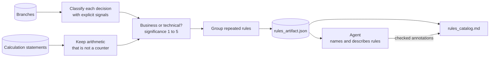

| Category | Typical signal | Counts as a business rule? |
|---|---|---|
| validation | the condition sets an error message or routes to error handling | yes |
| limit | a comparison with a threshold, or with a field named like MAX, MIN or LIMIT | yes |
| calculation | COMPUTE, ADD, SUBTRACT, MULTIPLY or DIVIDE on fields that are not counters | yes |
| routing | an EVALUATE branch that dispatches to different paragraphs or programs | yes |
| state_change | sets an 88-level condition | yes |
| decision | other decisions on business fields | when significance is 3 or more |
| error_handling | file status, SQLCODE, CICS response or return code checks | no (technical) |
| control_flow | end of file, counters | no (technical) |

Every candidate records:

- the signals that decided its category;
- its significance;
- whether it is reachable;
- the group it belongs to, when the same rule appears in several places.

The rules found in the built-in test system:

| Rule | Category | As coded | Source |
|---|---|---|---|
| `rule:ORDBATCH:29` | validation | `IF ORD-QTY <= ZERO` moves "Quantity must be positive" to the error message | `cbl/ORDBATCH.cbl:29` |
| `rule:ORDBATCH:33` | calculation | `COMPUTE WS-TOTAL ROUNDED = WS-TOTAL + ORD-QTY * ORD-PRICE` | `cbl/ORDBATCH.cbl:33` |
| `rule:PRICECHK:7` | limit | `IF ORD-PRICE > 10000` sets the order status to `'H'` (held) | `cbl/PRICECHK.cbl:7` |

**What the agent does.**

1. Reviews business rules, highest significance first.
2. Reads each rule's source and its program's summary.
3. Adds a `name` and `description`, and a `verdict` for candidates that were misclassified.
4. Checks its annotations and re-renders the catalogue.
5. Writes `rules_review.md` with the key rules, rules that never run, inconsistencies and coverage.

## 16. Agent 6: Diagrams

**Purpose.** Show the system visually, with every diagram generated from verified facts.

**Business use cases**

- **Onboarding and workshops:** system context and data lineage, each on one page.
- **Design reviews:** an ERD from declared keys, job flows and online conversations.
- **Code review:** paragraph structure, with unreachable and missing paragraphs highlighted.

**Where it acts.** After the rules stage. The diagrams are embedded in the BRD.

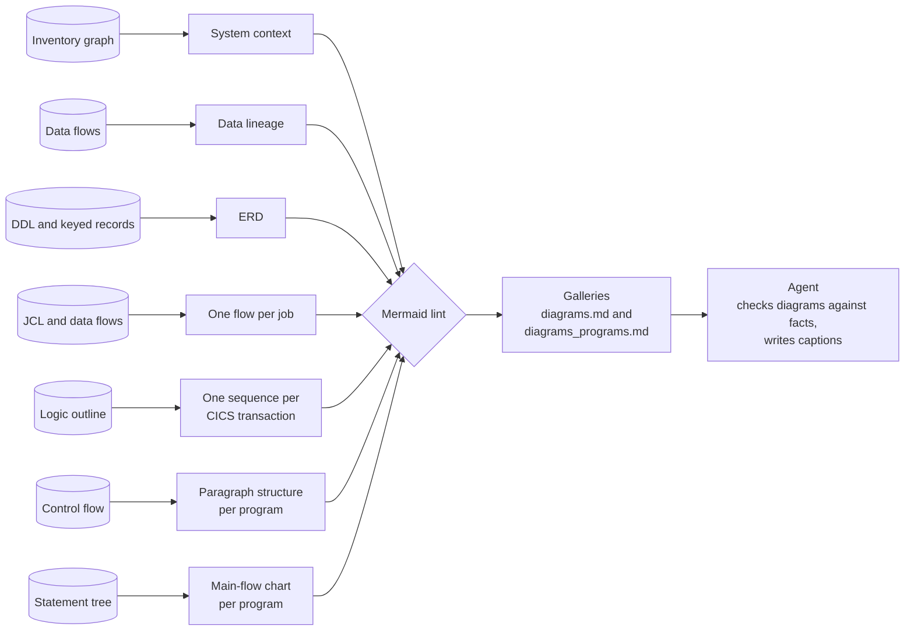

| Diagram | Built from | Shows |
|---|---|---|
| `system_context` | inventory graph | jobs and transactions, the programs they start, and CALL, LINK and XCTL links; unresolved targets are dashed |
| `data_lineage` | data flows | the programs that read and write each dataset, table and CICS file |
| `erd` | DDL and VSAM-keyed records | tables with primary and foreign keys, and keyed files |
| `job_<JOB>` | JCL and data flows | steps, programs, and datasets with DD names and direction |
| `transaction_<TRAN>` | logic outline | the CICS conversation: maps, LINKs two levels deep, and `opt` and `loop` blocks |
| `program_<P>_paragraphs` | control flow | PERFORM, GO TO and HANDLE edges; paragraphs that never run are grey, missing ones are red |
| `program_<P>_flow` | statement tree | the entry paragraph as a flowchart of decisions, loops, performs and ends |

The lint checks:

- the diagram type is declared;
- quotes are balanced;
- every edge uses declared nodes;
- sequence blocks are closed.

The galleries render directly on GitHub and in the VS Code Markdown preview.

**What the agent does.**

1. Compares at least five edges or messages per key diagram with the facts they came from.
2. Captions each system diagram, and any diagram that shows a finding.
3. Writes `diagram_review.md`.

## 17. Agent 7: Synthesis (BRD)

**Purpose.** Produce the Business Requirements Document: the system explained for business readers, with a prioritised register of gaps and risks.

**Business use cases**

- **Executive and sponsor briefing:** what the system does, what is broken and what to fix first.
- **Requirements baseline:** processes, rules and data in one document, for a replacement system.
- **Risk register:** every finding from every stage, consolidated, ranked and actionable.

**Where it acts.** After the diagrams. It is re-run at the end so that it includes every accepted annotation.

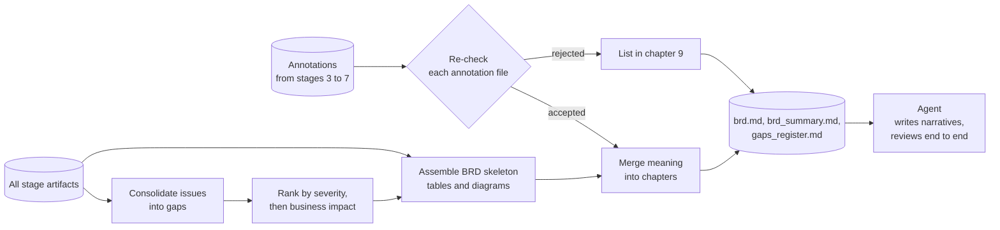

**The structure of the BRD**

| Chapter | Content | Source |
|---|---|---|
| 1 Executive summary | narrative and the highest-severity gaps | agent and gap register |
| 2 System overview | purpose narrative, counts, system context diagram | agent, inventory and data |
| 3 Business processes | for each job and transaction: narrative, program summaries, rules applied, flow diagram; also programs nobody starts | agent, logic, rules and diagrams |
| 4 Business rules | named rules, marked as enforced or never run | rules and annotations |
| 5 Data | stores with readers, writers and descriptions; key layouts; ERD and lineage | data and annotations |
| 6 Program reference | kind, entry point, size and complexity of each program | logic |
| 7 Gaps and risks | the consolidated register (high and medium), with first location and action | synthesis |
| 8 Recommendations | prioritised actions | agent |
| 9 About | input hashes, rejected annotations, glossary | synthesis |

**What the agent does.**

1. Writes narratives with evidence for `brd:executive_summary`, `brd:system_purpose`, `brd:process:<NAME>` and `brd:recommendations`.
2. Re-runs the stage until the gate passes.
3. Reads the final BRD as its audience would: no unexplained jargon, no claim without a citation, no contradiction between chapters.
4. Writes `synthesis_review.md` with coverage and open SME questions.

## 18. Agent 8: Knowledge graph

**Purpose.** Load the whole model into a graph database for impact analysis and exploration.

**Business use cases**

- **Change impact:** which programs, jobs and transactions are affected if this copybook or field changes?
- **Lineage queries:** the producers and consumers of every data store.
- **Risk views:** high-severity gaps and what they affect; rules that never run.

**Where it acts.** Last, and optionally.

The graph model (main node labels and relationships):

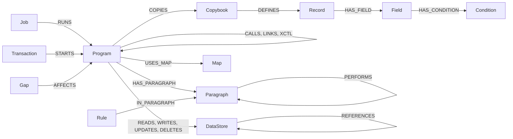

| Output | Purpose |
|---|---|
| `nodes/<Label>.csv`, `rels/<TYPE>.csv` | neo4j-admin bulk-import format (`id:ID`, `:LABEL`, `:START_ID`, `:END_ID`, `:TYPE`, typed columns) |
| `import.cypher` | a batched `UNWIND ... MERGE` script with uniqueness constraints, for `cypher-shell` or Neo4j Browser |
| `cypher_library.md` | parameterised analysis queries, each checked against the export schema |
| `README.md` | loading instructions for both options |

**What the agent does.**

1. Spot-checks relationships against their source artifacts.
2. Optionally, loads the export into a database the user names and runs the query library. It never loads into a database that already holds data without permission.
3. Writes `graph_review.md`.

---

# Part IV: Using the harness

## 19. Installation

Requires Python 3.10 or later.

```bash
git clone https://github.com/vighnasreevara/COBOL-Reverse-Engineering-Harness.git
cd COBOL-Reverse-Engineering-Harness
python -m venv .venv
.venv/Scripts/python.exe -m pip install -e ".[dev]"      # macOS / Linux: .venv/bin/python
```

The engine has no runtime dependencies. The `dev` extra adds `pytest` and `jsonschema`; with `jsonschema` installed, schema validation is strict.

## 20. Running an analysis

**1. Place the source.** Copy the exported members into `src/`, in any folder layout.

- Extensions such as `.cbl`, `.cpy`, `.jcl`, `.csd`, `.bms` and `.sql` are recognised.
- Extensionless members are classified by their content.

**2. Run every stage.**

```bash
.venv/Scripts/python.exe -m harness run-all --root src --system "Order Processing"
```

**3. Add meaning with the agents.**

Run the stage agents in order, `1_inventory` through `8_graph`:

- in Claude Code, ask for the agent by name (for example "use the 3_data agent");
- in GitHub Copilot, select the custom agent of the same name.

Each agent re-runs its stage, reviews the findings against the source and writes checked annotations. `8_graph` is optional.

**4. Read the results.** Start with `output/final_report/brd.md`, then `output/rules/rules_catalog.md` and `output/diagram/diagrams.md`.

**Analysing part of a system**

```bash
# only what transaction ORDI reaches
.venv/Scripts/python.exe -m harness run-all --root src --entry transaction:ORDI

# skip template members
.venv/Scripts/python.exe -m harness run-all --root src --exclude "templates/*"
```

## 21. A worked example

The test suite contains a small order-processing system:

| Member | What it is |
|---|---|
| `ORDBATCH` | batch program: reads orders, validates quantities, totals amounts, calls `PRICECHK` |
| `PRICECHK` | subroutine: puts high-priced orders on hold |
| `ORDINQ` | CICS inquiry: shows map `ORDMAP`, reads table `ORDERS_T`, LINKs to `PRICECHK` |
| `ORDREC` | copybook: the order record |
| `ORDJOB` | JCL job that runs `ORDBATCH` |
| `orders.csd`, `ORDSET`, `orders.sql` | CICS definitions, BMS mapset, DB2 tables `ORDERS_T` and `CUSTOMERS_T` |

Running the pipeline on it (excerpt of the console output):

```text
>>> inventory
Files           : 8 (bms 1, copybook 1, csd 1, ddl 1, jcl 1, program 3)
Programs        : 3 (batch: 1, online: 2)
References      : 15 (COPY 2, CALL 1, CICS LINK/XCTL 1, SQL INCLUDE 0, SQL table 1)
Resolution      : resolved 15
>>> parse
Paragraphs      : 5 in 0 sections
Statements      : 21
>>> data
Records         : 7 (copybook 1, program 6)
Data flows      : 3
>>> logic
Branches / loops: 3 / 1
>>> rules
Candidates      : 4 (calculation 1, control_flow 1, limit 1, validation 1)
Business rules  : 3 in 2 programs (0 unreachable)
>>> diagrams
Diagrams        : 11 (erDiagram 1, flowchart 9, sequenceDiagram 1)
>>> graph
Nodes           : 32 (Condition 2, Copybook 1, DataStore 4, Field 4, Job 1, Map 1, Paragraph 5, Program 3, Record 7, Rule 3, Transaction 1)
Relationships   : 34

All 8 stages completed and validated.
```

What the run establishes, with no manual work:

- **Batch flow:** job `ORDJOB` runs `ORDBATCH`, which reads `PROD.ORDERS` through DD `ORDERS` and writes `PROD.ORDER.REPORT`.
- **Online flow:** transaction `ORDI` starts `ORDINQ`, which reads table `ORDERS_T` and LINKs to `PRICECHK`.
- **Business rules**, each with its file and line:
  - an order line needs a positive quantity;
  - the order total is computed with rounding;
  - a price above 10,000 puts the order on hold.

## 22. Command reference

Every command has help: `python -m harness <command> --help`.

| Command | Stage | Main options | Output |
|---|---|---|---|
| `inventory` | 1 | `--root`, `--out`, `--entry`, `--exclude`, `--exclude-dir` | `output/inventory/` |
| `parse` | 2 | `--inventory`, `--out`, `--program` | `output/parser/` |
| `data` | 3 | `--inventory`, `--parser`, `--out` | `output/data/` |
| `logic` | 4 | `--inventory`, `--parser`, `--data`, `--out` | `output/logic/` |
| `rules` | 5 | `--parser`, `--logic`, `--out` | `output/rules/` |
| `diagrams` | 6 | `--inventory`, `--parser`, `--data`, `--logic`, `--out` | `output/diagram/` |
| `synthesize` | 7 | `--output-root`, `--system` | `output/final_report/` |
| `graph` | 8 | `--output-root`, `--system` | `output/final_report/graph/neo4j/` |
| `run-all` | 1 to 8 | `--root`, `--output-root`, `--system`, `--entry`, `--exclude` | everything above |
| `validate-inventory`, `validate-parser`, `validate-data`, `validate-logic`, `validate-rules` | – | the artifact path | re-checks an existing artifact |
| `check-annotations` | gate | the annotations file, `--artifact` (repeatable; a file or a folder), `--root` | accepted, or a list of problems |
| `sync-agents` | – | – | regenerates the Copilot agent and skill copies |

Every stage command also accepts `--no-timestamp` for byte-identical reruns.

| Exit code | Meaning |
|---|---|
| `0` | success |
| `1` | the artifact was written but failed validation |
| `2` | missing input or bad arguments |

## 23. Output reference

```text
output/
├── inventory/      inventory_artifact.json, inventory_review.md
├── parser/         parser_artifact.json, raw_structure/<PROGRAM>.json, parser_review.md
├── data/           data_artifact.json, data_layouts/, data_annotations.json, data_review.md
├── logic/          logic_artifact.json, program_logic/<PROGRAM>.json, logic_annotations.json, logic_review.md
├── rules/          rules_artifact.json, rules_catalog.md, rules_annotations.json, rules_review.md
├── diagram/        diagrams_artifact.json, diagrams/*.mmd, diagrams.md, diagrams_programs.md,
│                   diagram_annotations.json, diagram_review.md
└── final_report/   synthesis_artifact.json, brd.md, brd_summary.md, gaps_register.md,
                    synthesis_annotations.json, synthesis_review.md,
                    graph/neo4j/   nodes/, rels/, import.cypher, cypher_library.md, README.md
```

Every artifact has a schema in `schemas/`. Each records its generator, its generator version, when it was generated, and the SHA-256 of its inputs, so any deliverable can be traced to the exact artifacts it was built from.

## 24. Gap and risk register

Synthesis consolidates every finding into one register.

- **A gap** is one finding code for one subject (a program, copybook, dataset or job), with all its locations and a recommended action.
- **Gap ids are stable** across runs (`gap:<code>:<subject>`), so annotations can refer to them.

| Category | Examples | Typical severity |
|---|---|---|
| Logic risk | business rules in code that never runs, recursive PERFORM, loops that may not end, ALTER | high |
| Missing source | missing programs, copybooks, SQL members, BMS maps | high |
| Data integrity | record length, VSAM key, CICS record size, SQL column or type mismatches | high to medium |
| Configuration | CICS program not in the CSD, DB2 program without attach, JCL control cards outside in-stream data | high |
| Incomplete code | undefined paragraphs or data names, truncated members, procedure code in storage | high |
| Code quality | literals truncated at column 72, free-format source | medium to low |
| Housekeeping | unused copybooks, subroutines without callers | low |

**Ordering.** Gaps are sorted by severity first. Within a severity they are ordered by business impact (logic risk first), then by how many occurrences they have.

**No finding is dropped.** A finding code without an explicit policy takes its severity from its original level: error becomes high, warning becomes medium, info becomes low.

---

# Part V: Engineering

## 25. Repository layout

```text
.
├── harness/                   deterministic engine
│   ├── cobol/                 source normalisation, tokenizer, COBOL vocabulary
│   ├── common/                file reading, issues, schema checks, annotation gate
│   ├── inventory/             stage 1: classification, scanners, JCL/CSD/BMS/DDL/IDCAMS readers, scope
│   ├── parser/                stage 2: copybook expansion, data and procedure parsing, control flow
│   ├── data/                  stage 3: PICTURE and storage rules, layouts, SQL checks, data model
│   ├── logic/                 stage 4: outline, branches, loops, I/O, pseudocode
│   ├── rules/                 stage 5: classification, grouping, catalogue
│   ├── diagram/               stage 6: Mermaid writers, lint, galleries
│   ├── synthesis/             stage 7: gap policy, BRD assembly
│   ├── graph/                 stage 8: Neo4j export, query library
│   ├── cli.py                 command line
│   └── sync_agents.py         generates the Copilot copies of the agents
├── schemas/                   JSON Schemas for every artifact
├── .claude/agents, skills     Claude Code agents and skills (source of truth)
├── .github/agents, skills     GitHub Copilot agents and skills (generated)
├── tests/                     unit, stage and end-to-end tests, with a built-in COBOL system
├── src/                       place the COBOL system to analyse here
└── output/                    generated by runs
```

## 26. Quality: validation and testing

**Validation on every run.** Besides its JSON Schema, every stage checks its artifact against itself:

| Stage | Self-checks |
|---|---|
| Inventory | statistics recomputed from the arrays; ids unique; every reference cites a scanned file and a valid line; every edge endpoint is a graph node; copybook usage consistent |
| Parser | control-flow nodes match paragraphs; the dead-paragraph list matches reachability; every statement's line exists in its source file; metrics match the lists |
| Data | every field lies inside its record; records, fields, conditions, flows and relationships reference existing items |
| Logic | metrics match the lists; ids unique; every pseudocode line cites an existing source line |
| Rules | statistics recomputed; ids unique; business rules are never in a technical category; every rule's branch exists in the logic stage |
| Diagrams | every diagram passes the Mermaid lint, and its file exists and is unchanged |
| Synthesis | every `file:line` cited in the BRD exists; gap ids unique; rejected annotations reported |
| Graph | CSV headers in neo4j-admin format; unique ids; no relationship points at a missing node; the query library uses only exported labels, types and properties |

**Automated tests.** Run them with `.venv/Scripts/python.exe -m pytest`. They cover:

- the tokenizer and source normaliser;
- every reader: COBOL references, JCL, CSD, BMS, DDL, IDCAMS;
- copybook expansion with REPLACING;
- the statement tree and control flow;
- storage-size rules and SQL host-variable checks;
- loop termination and rule classification;
- the Mermaid lint and the gap policy;
- the agent definitions staying in sync across platforms;
- a full end-to-end run of all eight stages on the built-in order-processing system.

## 27. Extending the harness

**Adding a finding.**

1. Emit an issue with a new code in the relevant stage.
2. If it needs a specific severity and action, add it to the gap policy in `harness/synthesis/gaps.py`.
3. Add a test.

**Adding a stage.** Follow the existing pattern:

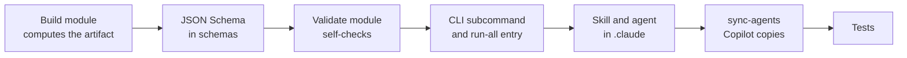

**Tuning rule classification.**

1. Edit the signal patterns in `harness/rules/build.py`: status fields, error text, limit names and counters.
2. Add test cases for the new patterns.

## 28. Known limitations

| Area | Limitation |
|---|---|
| COBOL dialect | Nested programs are read as part of the outer program. Qualified names (`A OF B`) are reduced to the leading name. COPY REPLACING covers the common forms. |
| Data | SYNC slack bytes are not added. OCCURS DEPENDING ON uses the maximum size. EBCDIC files must be converted before scanning. |
| Dynamic behaviour | Dynamic CALL targets are resolved only through literal assignments. SQL built at run time is not analysed. JCL symbolic parameters are not substituted. |
| Scope | Catalogued PROCs and members outside the scanned folder are recorded as external or missing. |
| Rules | Classification is heuristic and explained by its signals. Agents correct meaning through verdicts. |
| Diagrams | Diagrams are linted structurally; Mermaid itself is not executed during the run. |
| Graph | The export is validated. Loading it into Neo4j is an optional step, done manually or by the agent. |

## 29. Glossary

| Term | Meaning |
|---|---|
| Artifact | The JSON output of a stage, validated before any later stage uses it |
| Annotation | Agent-written meaning (name, description, summary, narrative, caption, note or verdict) that must cite evidence |
| Gate | `check-annotations`: accepts an annotation only if its target and its evidence exist |
| BRD | Business Requirements Document |
| Copybook | A shared source member copied into programs with COPY |
| Paragraph, section | Named blocks of procedure code, executed by PERFORM |
| 88 level | A named value of a field; for example `ORD-HELD` means `ORD-STATUS = 'H'` |
| COMP-3 | Packed-decimal storage |
| JCL | Job Control Language, which defines batch jobs, steps and datasets |
| DD | A JCL data definition linking a program's file name to a dataset |
| CICS, CSD | The online transaction monitor, and its resource definitions |
| BMS | CICS screen map definitions |
| VSAM KSDS | A keyed file |
| IDCAMS | The utility that defines VSAM clusters |
| DB2 DDL | Table definitions for the DB2 database |
| Dead code | Code that no execution path can reach |
| Gap | A consolidated finding with a severity, its locations and a recommended action |

## 30. License

Released under the [MIT License](LICENSE). Copyright (c) 2026 vighnasreevara.
